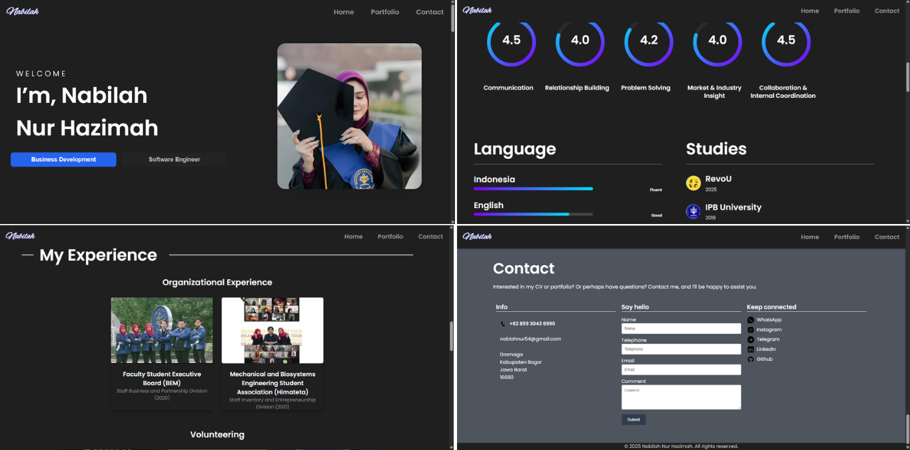

# Nabilah Nur Hazimah - Personal Portfolio

<p align="center">
	
</p>

<p align="center">
	Portofolio personal yang menampilkan profil, pengalaman, sertifikat, dan project showcase dengan pendekatan modern, interaktif, dan mobile-friendly.
</p>

<p align="center">
	<a href="https://nabilahnurhazimah.my.id">Live Website</a>
	|
	<a href="https://docs.google.com/document/d/1vQmc5B1rz7LEpmpSkbZcPemeWume-slI/edit?usp=sharing&ouid=102538993394413215208&rtpof=true&sd=true">Download CV</a>
	|
	<a href="https://github.com/awxbila">GitHub</a>
	|
	<a href="https://www.linkedin.com/in/abilanr/">LinkedIn</a>
</p>

<p align="center">
	
	
	
	
</p>

## Tentang Proyek

Website ini dibangun untuk personal branding sebagai Full-Stack Developer, dengan latar belakang engineering dan minat kuat pada software development.

Halaman utama merangkum:

- Profil singkat dan personal statement
- Riwayat studi dan performa
- Tools, technologies, dan soft skills
- Experience timeline dengan filter
- Certificates gallery
- Showcase 6 project utama
- Tombol download CV
- Contact section dengan form kirim pesan

## Fitur Unggulan

- Intro splash screen dengan animasi pembuka
- Typewriter effect pada hero section
- Navigasi responsif (desktop + hamburger mobile)
- Section reveal animation berbasis Intersection Observer
- Tabs untuk Experience, Certificates, dan Projects
- Filter kategori pada Experience (Working, Organizational, Volunteer)
- Halaman detail untuk setiap project di folder projects
- Contact form terintegrasi FormSubmit

## Tech Stack

| Area                       | Teknologi                                                                      |
| -------------------------- | ------------------------------------------------------------------------------ |
| Frontend                   | HTML5, CSS3, JavaScript                                                        |
| UI/UX                      | Custom CSS, Responsive Design, Font Awesome, Boxicons                          |
| Deployment                 | GitHub Pages / custom domain                                                   |
| Form Service               | FormSubmit (AJAX endpoint)                                                     |
| Pendukung Project Showcase | Next.js, NestJS, TypeScript, PostgreSQL, Prisma, Flask, YOLOv8, OpenCV, Docker |

## Project Showcase

| Project           | Fokus                           | Detail                                               | Live                                      | Repository                                                                                       |
| ----------------- | ------------------------------- | ---------------------------------------------------- | ----------------------------------------- | ------------------------------------------------------------------------------------------------ |
| RevoEdu           | LMS Full-Stack Web App          | [projects/lms.html](projects/lms.html)               | -                                         | [RevoEdu](https://github.com/awxbila/RevoEdu.git)                                                |
| RevoShop          | E-Commerce Full-Stack           | [projects/ecommerce.html](projects/ecommerce.html)   | [Demo](https://revoshop-9vpz.vercel.app/) | [RevoShop](https://github.com/awxbila/revoshop.git)                                              |
| RevoBank          | Backend Banking API             | [projects/revobank.html](projects/revobank.html)     | -                                         | [RevoBank API](https://github.com/awxbila/RevoBank-API.git)                                      |
| RevoFun           | Browser Mini Games              | [projects/game.html](projects/game.html)             | -                                         | [RevoFun](https://github.com/awxbila/RevoFun2.git)                                               |
| Portfolio Website | Frontend Personal Branding      | [projects/porto.html](projects/porto.html)           | [Live](https://nabilahporfo.my.id)        | [Portfolio Repo](https://github.com/awxbila/Portofolio.git)                                      |
| Peduli Stroberi   | Computer Vision for Agriculture | [projects/strawberry.html](projects/strawberry.html) | -                                         | [Peduli Stroberi](https://github.com/awxbila/skripsi-deteksi-penyakit-daun-tanaman-stroberi.git) |

## Struktur Folder

```text
.
|- index.html
|- README.md
|- assets/
|  |- css/
|  |  |- style.css
|  |- img/
|  |- js/
|     |- main.js
|- projects/
|  |- ecommerce.html
|  |- game.html
|  |- lms.html
|  |- porto.html
|  |- revobank.html
|  |- strawberry.html
```

## Menjalankan Secara Lokal

1. Clone repository ini.
2. Buka folder project.
3. Jalankan dengan Live Server agar semua fitur (terutama form dan behavior JS) berjalan optimal.
4. Alternatif cepat: buka file index.html langsung di browser.

Catatan:
Contact form tidak bisa mengirim pesan jika file dibuka lewat protokol file lokal. Gunakan Live Server atau versi website yang sudah ter-deploy.

## Kontak

- Email: nablahnur54@gmail.com
- Phone: +62 859 3043 6990
- LinkedIn: https://www.linkedin.com/in/abilanr/
- GitHub: https://github.com/awxbila
- Telegram: https://t.me/awbila
- Instagram: https://www.instagram.com/abilanr

## Closing

From your vision to my code.

Terima kasih sudah berkunjung ke portfolio ini.
